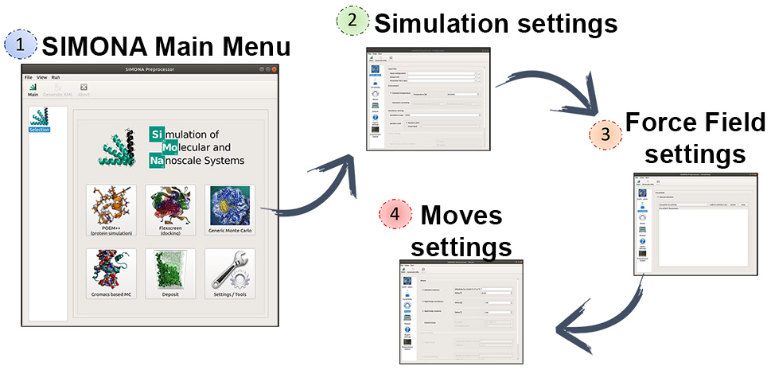

Basic User Tutorials
++++++++++++++++++++++

In this tutorial you will learn how to use the Graphical User 
interface of SIMONA to obtain the input files to perform a 
generic MC simulation.

Generic Monte Carlo - Protein Simulations
=========================================

Generic Monte Carlo - Organic Molecules
=======================================

Flex doc - Docking in protein receptors
=======================================