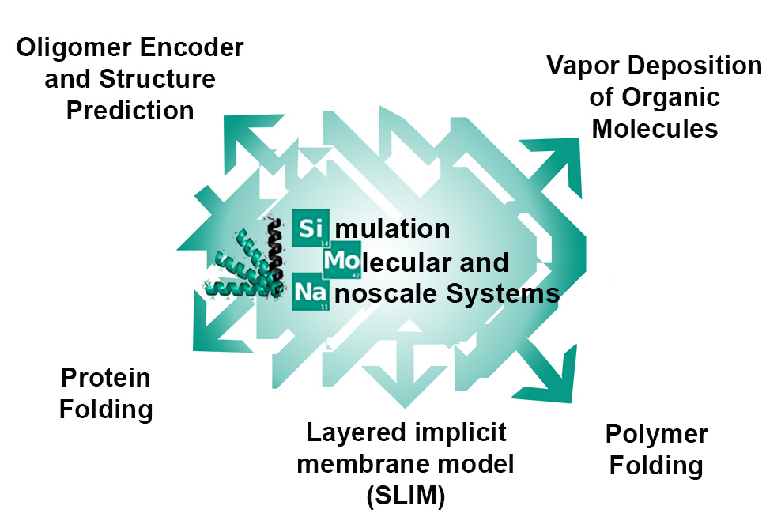

.. SIMONA documentation master file, created by
   sphinx-quickstart on Tue Mar  1 10:37:56 2022.
   You can adapt this file completely to your liking, but it should at least
   contain the root `toctree` directive.

Welcome to SIMONA's documentation!
==================================

.. caution::
   Documentation is in construction.

**Simulation of Molecular and Nanoscale Systems (SIMONA)** is a generalized simulation 
kernel and a specific simulation pre-processor, which enables rapid prototyping of 
forcefields and simulation methods for efficient Monte Carlo simulations. It is 
written in a modular manner to allow efficient code reuse for both the developer 
and the user of the program.

**SIMONA could conduct to :**

.. toctree::
   :maxdepth: 2
   :hidden:
   :caption: Guidelines:

   GuideLines/InstallationGuide
   GuideLines/citeSIMONAPublications

.. toctree::
   :maxdepth: 2
   :hidden:
   :caption: Tutorials:

   Tutorials/BasicUser
   Tutorials/AdvanceUser
   Tutorials/DeveloperUser

.. toctree::
   :maxdepth: 2
   :hidden:
   :caption: SIMONA Documentation:

   SIMONADoc/SPFFile
   SIMONADoc/XMLFile
   SIMONADoc/SMLFile
   SIMONADoc/Outputs
   SIMONADoc/FFTerms
   

.. |date| date:: %b %d, %Y

This document was generated |date|.
